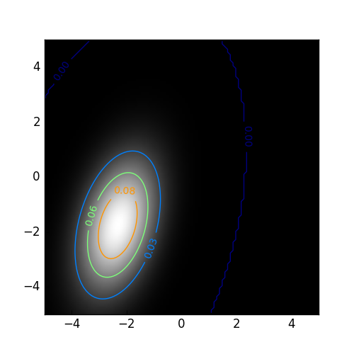

# Allocatable Arrays

## Purpose
This simple example computes a rotated two-dimensional (2D) Gaussian curve following the formula (https://en.wikipedia.org/wiki/Gaussian_function), as an example of moving data between host and device. This example can be basically extended to any other application where some basic arrays need to be copied to the device for a data-exhaustive computations and the results be copied back to the host. 

The idea is to: 
+ centralize the declaration of allocatable arrays for the device inside a `vars` module, and move them around through the subsequent function calls from other modules.
+ avoid the updating the variables on the host using the `!$acc update` directive; the `!$acc exit data` clause does the job.

## Contents
- `Makefile` to build the example
- `main.f90` which is the basic caller
- `vars.f90` which defines the variables, allocates the allocatable arrays, and takes care of host-to-device (`h2d()`) and device-to-host (`d2h()`) data transfer using the `!$acc enter data` and `!$acc exit data` clauses. 
- `kern.f90` which 

## Tips
+ It is possible to allocate an array declared as `allocatable` on the device. This means, the call to `alloc()` and `h2d()` functions in the `main` program are interchangeable.
+ The `exit data` clause does not `delete` the arrays, but rather does a `copyout` operation to move the data out of device to the host. 

## Result

## Next Step
With the more recent PGI support for allocatable arrays in derived types, the same example is also reproduced by porting and declaring the variables in `vars.f90` module to a derived-type. For that, you may refer to the [derived_types](https://github.com/moravveji/OpenACC/tree/master/derived_types) example.
