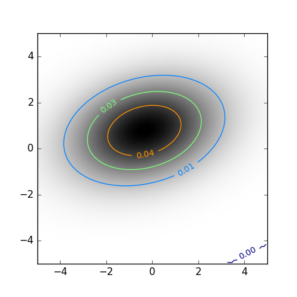

# Fortran Derived Types

## Purpose
This small project tries to exploit using Fortran 90 derived types, with allocatable arrays. The purpose is to manage the data transfer between the host and device through using the `!$acc enter data` and `!$acc exit data` clauses. The derived types contains necessary information for a 2-dimensional Gaussian curve (https://en.wikipedia.org/wiki/Gaussian_function). This example builds on the more simple example with [allocatable_arrays](https://github.com/moravveji/OpenACC/tree/master/allocatable_arrays), where no typed variables are used, and the variables are module-wide and defined in `vars.f90` file.

## Content
+ `vars.f90` module where the derived type and the data movement subroutines are defined
+ `kern.f90` module which contains the kernel for filling up the 2D Gaussian curve
+ `io.f90` module for a basic flushing of the data to an ASCII file for plotting
+ `main.f90` program file which `use`s the other two modules, moves the data around, and launches the kernel.
+ `plotter.py` for a simple plotting of the `gaussian2d.txt` file, to make sure that the 2D Gaussian bell curve looks OK on a coarse grid.

## Tips
+ A mistake I made was to compile each module with the `-c` flag, and link them all with the `-acc -ta=tesla:cuda8.0,cc35 -Minfo=accel` flags. However, the code does not execute on the device with this build. Instead, the entire `-acc -ta=tesla:cuda8.0,cc35 -Minfo=accel` should be used for compilation and linking, respectively.
+ The inline `do` loops must be avoided. E.g. the following 
```fortran 
a% x(1 : a% nx) = (/ (xlo + (k-1) * dx, k = 1, a% nx) /)
```
must be replaced by an explicit loop

```fortran 
do k = 1, a% nx
   a% x(k) = xlo + (k-1) * dx
enddo 
```
otherwise, the CUDA kernel cannot be generated by the compiler.

## Results


## Optimizing Loop(s)
We measure the mean time lapse of calling `set_xy()` and `gen_gauss2s()` functions for `ntimes=5`. The three loops in `set_xy()` function is much more efficient with `kernels` directive than with `parallel loop`. So, one must basically play around with different parallel regions on what is the best. For `nx=10001, ny=10001`, each iteration of the workflow took the following amounts of time with the given fine-tuned parallelism options:
+ 3.30 sec: Intel(R) Xeon(R) CPU E5-2650 v3 @ 2.30GHz, with OpenACC turned off
+ 0.14 sec: (default); not specifying anything
+ 3.21 sec: using `num_gangs(1) vector_length(128)` 
+ 6.45 sec: `num_gangs(1) vector_length(64)` 
+ 12.8 sec: `num_gangs(1) vector_length(32)` 
+ 1.59 sec: `num_gangs(2) vector_length(128)` 
+ 0.81 sec: `num_gangs(4) vector_length(128)` 
+ 0.41 sec: `num_gangs(8) vector_length(128)` 
+ 0.21 sec: `num_gangs(16) vector_length(128)` 
+ 0.10 sec: `num_gangs(32) vector_length(128)` 
+ 0.11 sec: `num_gangs(64) vector_length(128)` 
+ 0.14 sec: `num_gangs(128) vector_length(128)` 

So, obviousely, `vector_length(128)` is the most optimal vector size, and increasing `num_gangs` up to 32 gives a performance better than the default. Despite the fact that the warp size on the K40 NVIDIA GPU that was used for this example is 32, a vector length of 32 does not necessarily result in the best performance.

Now, we play around with multiples of 10 for the number of gangs and the vector length:
+ 3.64 sec: `num_gangs(10) vector_length(10)` 
+ 0.41 sec: `num_gangs(10) vector_length(100)` 
+ **.087 sec: `num_gangs(100) vector_length(100)`**
+ 0.13 sec: `num_gangs(1000) vector_length(100)` 

So, multiples of 10 are competitively nice, up to some saturation value for `num_gangs` around 100. `num_gangs(100) vector_length(100)` even performs better than `num_gangs(32) vector_length(128)`. 

Comparing the runtime of the single-CPU vs. the best GPU performance, a speed up of about **40x** is achieved.


